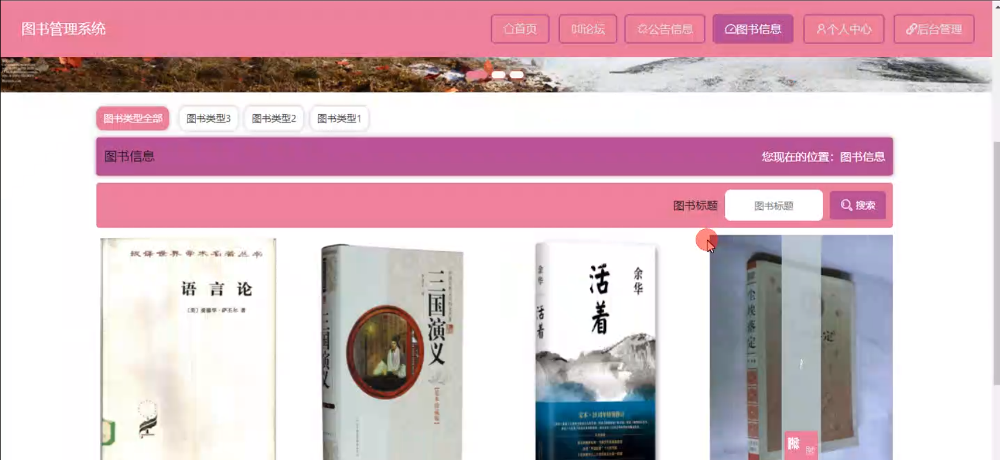

# 基于springboot的图书管理系统

#### 介绍

随着知识的普及和文化的发展，图书在人们的生活中扮演着越来越重要的角色。为了更高效地管理图书资源，为读者提供优质的服务，我们开发了这套基于 Spring Boot 的图书管理系统。

#### 技术栈

后端技术栈：Springboot+Mysql+Maven

前端技术栈：Vue+Html+Css+Javascript+ElementUI

开发工具：Idea+Vscode+Navicate

#### 系统功能介绍

（一）管理员角色  
个人中心：管理员可以在个人中心查看和修改个人信息，查看操作日志和系统通知。  
管理员管理：对其他管理员账号进行管理，包括添加新管理员、修改管理员信息、设置管理员权限等。  
基础数据管理：维护图书管理所需的基础数据，如图书分类、出版社信息、作者信息等。  
论坛管理：监督图书相关论坛的交流内容，处理违规言论和不当信息，确保论坛的交流氛围积极健康。  
公告信息管理：发布和管理图书馆的公告信息，如开闭馆时间调整、新书上架通知、活动公告等。  
图书信息管理：全面管理图书的详细信息，包括书名、作者、出版社、出版年份、ISBN 号、图书简介、库存数量等，同时对图书的入库、出库、盘点等进行操作。  
借阅信息管理：处理读者的借阅申请，包括借阅审批、借阅时间设置、续借和归还管理，以及对逾期未还的处理。  
用户管理：对读者用户的信息进行管理，包括注册审核、用户信息修改、用户权限设置等。  
轮播图信息：负责图书馆活动、重点推荐图书等轮播图的内容更新和展示设置。  

（二）用户角色  
论坛：用户可以在论坛中交流读书心得、分享阅读体验、推荐好书，也可以向其他读者咨询问题。  
公告信息：及时获取图书馆发布的各类公告信息，了解图书馆的最新动态和相关规定。  
图书信息：查询图书馆内的图书详细信息，通过多种筛选条件快速找到感兴趣的图书。  
个人中心：查看个人资料、借阅记录、预约记录等，修改个人密码和联系信息。  
后台管理  
论坛管理：管理自己在论坛发布的内容，回复其他读者的评论和私信。  
公告信息管理：标记已读公告，方便后续查看重要通知。  
图书信息管理：收藏感兴趣的图书，对已阅读的图书进行评价和标注。  
借阅信息管理：提交借阅申请、办理续借手续、查看借阅历史。  

#### 系统作用

提高管理效率  
自动化和规范化图书管理流程，减少人工操作的繁琐和错误，提高工作效率。  
优化资源配置  
精确掌握图书的库存和借阅情况，合理采购新书，提高图书资源的利用率。  
提升服务质量  
为读者提供便捷的图书查询和借阅服务，促进读者之间的交流与互动。  
增强读者体验  
个性化的服务和丰富的信息，满足读者的多样化需求，提高读者对图书馆的满意度和忠诚度。  
数据统计与分析  
对图书借阅、读者行为等数据进行统计和分析，为图书馆的发展决策提供依据。  

#### 系统功能截图

代码结构

数据库表

登录

公告信息

论坛

图书信息

个人中心

用户端后台管理

公告信息管理

借阅信息管理

管理员端基础数据管理

图书信息管理

用户管理

轮播图信息管理

#### 总结

基于 Spring Boot 的图书管理系统，通过清晰划分管理员和用户的功能模块，实现了图书管理的信息化和智能化。该系统不仅提升了图书馆的管理水平和服务质量，也为读者创造了更好的阅读环境和体验，促进了知识的传播和文化的交流。

#### 使用说明

创建数据库，执行数据库脚本 修改jdbc数据库连接参数 下载安装maven依赖jar 启动idea中的springboot项目

前台登录页面
http://localhost:8080/tushuguanli/front/index.html

后台登录页面
http://localhost:8080/tushuguanli/admin/dist/index.html

管理员				账户:admin 		密码：admin

用户				账户:a1 		密码：123456
